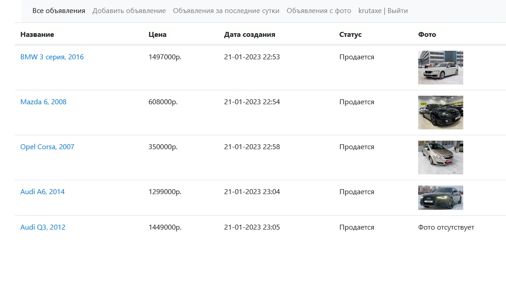
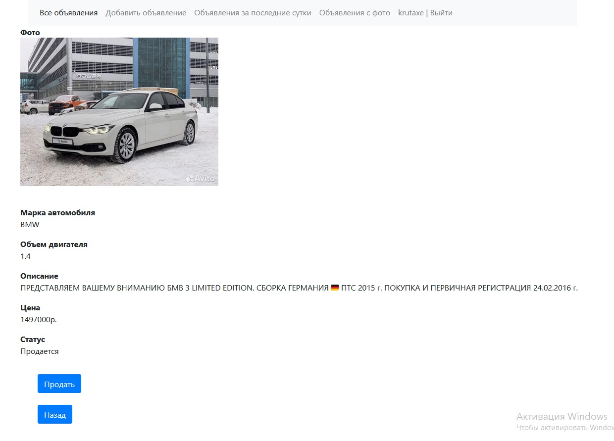

# job4j_cars

## *Продажа автомобилей*

### *Описание*
Web приложение для объявлений по продаже автомобилей.
Есть возможность: добавлять объявления, отмечать проданные автомобили,
                  есть фильтр по объявлениям с фотографией и объявления
                  добавленные за последние сутки.

### *Стек технологий*

1. Spring boot 2.7.3
2. Thymeleaf 2.7.3
3. Bootstrap 4.4.1
4. Hibernate 5.6.11 Final
5. PostgreSql 14.1
6. Lombok 1.18.22

### *Требование к окружению*
Java 17, Maven 3.8, PostgreSQL 14

### *Запуск приложения*

    Запуск с помощью командной строки:
    1.Перейти в папку с проектом.
    2.Выполнить команду: mvn liquibase:update
    3.Выполнить команду: mvn clean install
    4.Выполнить команду: mvn spring-boot:run
    5.Перейти по ссылке: http://localhost:8080/posts 

### *Список всех объявления*

### *Подробности одного объявления*

### *Добавление объявления*

